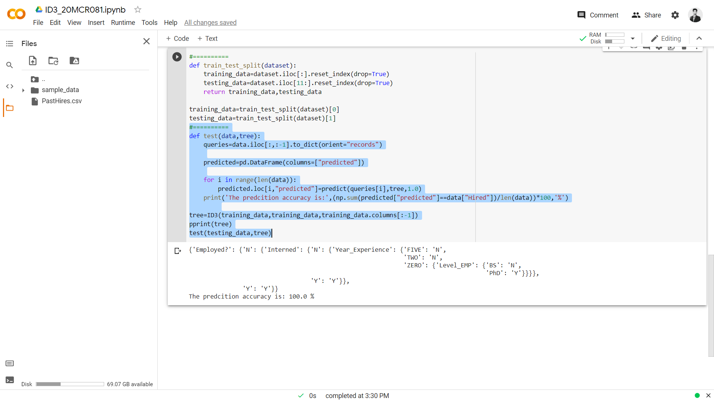

# Title : ML-LAB_EXP ( Author : Vishal Kumar )
 

## This Repo has created to host my ML Lab Experiments.

## This Repo consist List of the following supervised learning algorithm experiments.
1. [FIND-S Algorithm ](/find-S-algorithm/find-s.md)
 
3. Candidate Elimination Algorithm
4. Naive Bayes Algorithm
5. ID3 (Iterative Dichotomiser 3) Algorithm
6. K-Nearest Neighbors Algorithm

